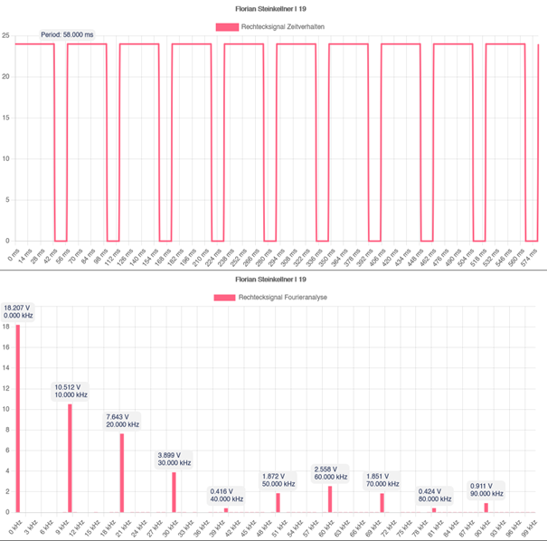

# :computer: FourierAnalysis
A demo of Fourier-Analysis for a school :mortar_board: project.  
When loading the page, the calculated values are logged to the console :100:.

## :book: Libraries
This project uses the [Chart.js](https://www.chartjs.org/docs/latest/) library for displaying the charts. 
[JQuery](https://jquery.com/download/) is used to tidy up the dom methods.

## :floppy_disk: Screenshots
### :abacus: Settings

### :chart_with_upwards_trend: Rectangle Signal

